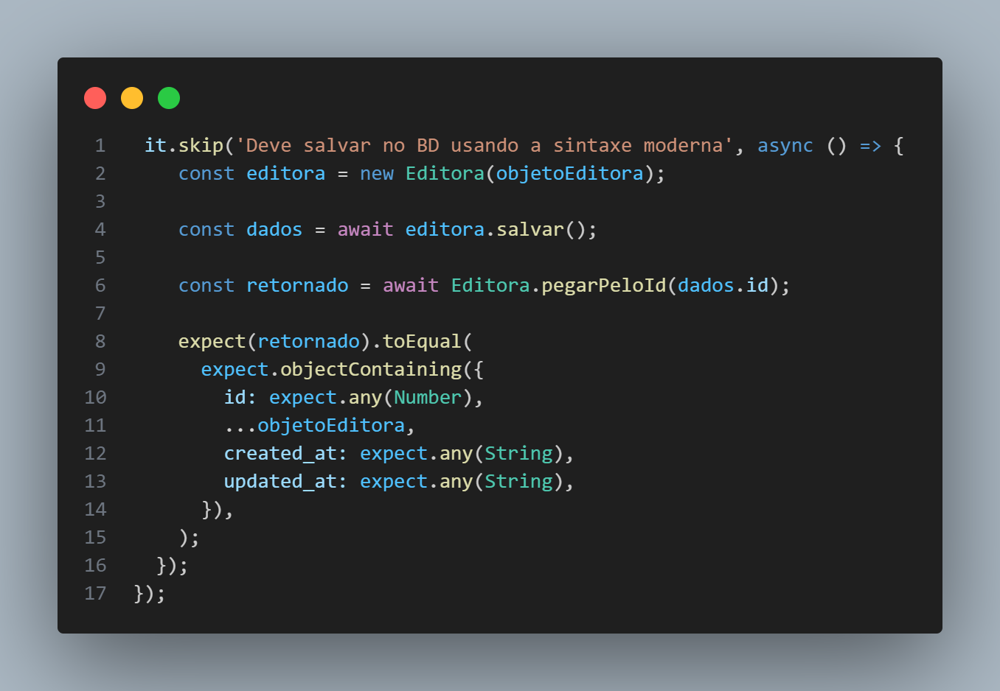

# Por que usar mocks

Num projeto como o desta api, testar as funções sem mockar gerará confusão no banco de dados e consequente uso do cliente, visto que nessa função por exemplo, usamos editora.salvar, incluindo o objeto de teste no bd real

